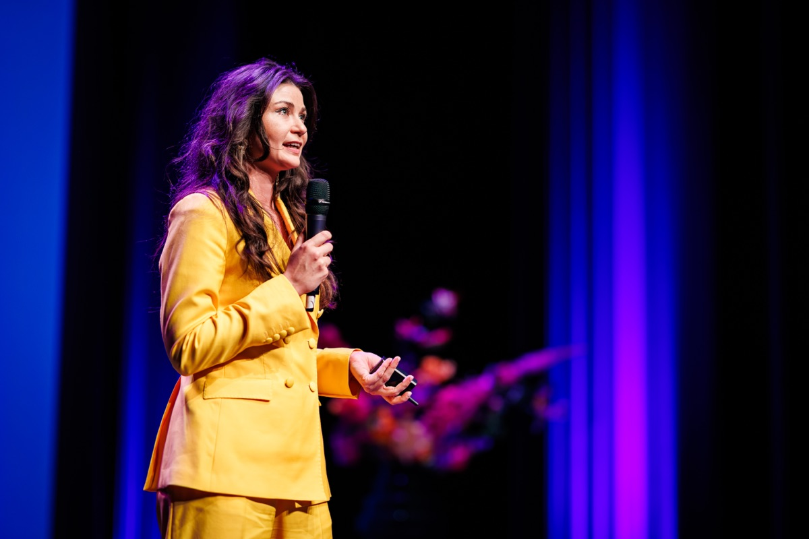

# karinvantongerlo.nl

Persoonlijke website van Karin van Tongerlo. Plain HTML/CSS/JS — geen buildstap.

## Bestanden
- `index.html` — de hele pagina (één pagina, met secties)
- `styles.css` — alle styling + kleuren (bovenin staan de kleuren als variabelen)
- `script.js` — menu, scroll-animaties, jaartal
- `images/` — zet hier je foto neer (zie hieronder)

## Lokaal bekijken
Dubbelklik `index.html`, of (handiger, voor live herladen):

```bash
python3 -m http.server 8000
```

Open dan http://localhost:8000 in je browser.

## Tekst & foto aanpassen
Zoek in `index.html` op `TODO:` — daar staat overal wat je moet vervangen:
- je eigen verhaal bij "Over mij"
- je drie diensten bij "Aanbod"
- een echte quote
- je e-mailadres en LinkedIn-URL onderaan

**Foto toevoegen:** maak een map `images/`, zet daar `karin.jpg` in, en
vervang in `index.html` het blok `<div class="photo-placeholder">…</div>` door:

```html

```

**Kleuren aanpassen:** bovenin `styles.css` onder `:root` staan alle kleuren.

## Online zetten via Hostnet (FTP)
Hostnet is klassieke webhosting, dus je uploadt simpelweg de bestanden.

1. Vraag je FTP-gegevens op in het Hostnet-controlepaneel
   (host, gebruikersnaam, wachtwoord) — of gebruik de Bestandsbeheer in het paneel.
2. Gebruik een FTP-programma zoals **FileZilla** (gratis).
3. Verbind en ga naar de webmap (meestal `httpdocs`, `public_html` of `www`).
4. Upload **de inhoud** van deze map: `index.html`, `styles.css`, `script.js`
   en de `images/`-map.
5. Klaar — check https://karinvantongerlo.nl

Bij een volgende wijziging upload je gewoon het gewijzigde bestand opnieuw (overschrijven).

## Versiebeheer (optioneel)
De code staat ook op GitHub. Wijzigingen bewaren:

```bash
git add .
git commit -m "Tekst en foto bijgewerkt"
git push
```
